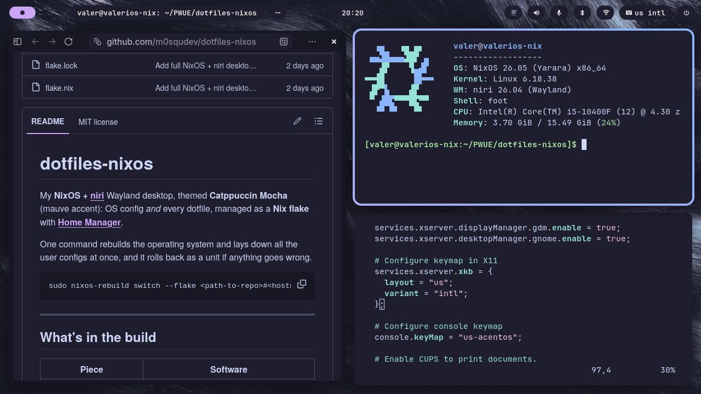

# dotfiles-nixos

My **NixOS + [niri](https://github.com/YaLTeR/niri)** Wayland desktop, themed
**Catppuccin Mocha** (mauve accent): OS config *and* every dotfile, managed as a
**Nix flake** with **[Home Manager](https://github.com/nix-community/home-manager)**.

One command rebuilds the operating system and lays down all the user configs at
once, and it rolls back as a unit if anything goes wrong.

```
sudo nixos-rebuild switch --flake <path-to-repo>#<hostname>
```

---

## Screenshots



*niri's scrollable tiling with Waybar on top — zen browser on the left, and a stacked
pair of terminals on the right (fastfetch and `nixos/configuration.nix` in vim). The
whole desktop is themed **Catppuccin Mocha** with a mauve accent.*

---

## What's in the build

| Piece | Software |
|---|---|
| Compositor / WM | **niri** (scrollable-tiling Wayland) |
| Status bar | **waybar** (+ custom module scripts) |
| Notifications & quick settings | **swaync** |
| On-screen display (volume/brightness) | **swayosd** |
| Launcher | **fuzzel** |
| Emoji / character picker | **rofimoji** (`Mod+.`, via fuzzel) |
| Lock screen | **hyprlock** (primary) · **swaylock-effects** (fallback) |
| Terminal | **GNOME Console (kgx)**, patched to a Catppuccin Mocha palette |
| GTK theme | **catppuccin-gtk** (mauve) · adw-gtk3 · Papirus-Dark icons · Catppuccin cursors |
| Qt / KDE theme | **Kvantum** `catppuccin-mocha-mauve` · qt6ct |
| Text-editor theme | GtkSourceView 5 Catppuccin Mocha scheme (GNOME Text Editor) |
| Input method | **fcitx5 + Mozc** (Japanese; US-intl / US / JP cycling) |
| GPU | NVIDIA GTX 1650, proprietary driver (reliable suspend/resume) |
| Login | GDM → niri session |

---

## Repository layout

```
dotfiles-nixos/
├── flake.nix                  # entry point: system + Home Manager, pinned nixpkgs
├── flake.lock                 # exact input versions (reproducibility)
├── nixos/
│   ├── configuration.nix       # the system config (verbatim from /etc/nixos)
│   ├── hardware-configuration.nix   # ⚠ machine-specific: REGENERATE on other machines
│   └── kgx-catppuccin-mocha.patch   # applied to gnome-console by an overlay
├── home/
│   └── home.nix                # Home Manager: which dotfile goes where
├── config/                     # → ~/.config/*
│   ├── niri/  waybar/  swaync/  swayosd/  swaylock/  hypr/  fuzzel/
│   ├── kgx-mocha/  Kvantum/  qt6ct/  fcitx5/  autostart/
│   ├── gtk-3.0/  gtk-4.0/  kdeglobals
├── local/
│   └── share/gtksourceview-5/styles/catppuccin-mocha.xml   # → ~/.local/share/...
└── assets/
    ├── wallpapers/wall.jpg     # → ~/.local/share/backgrounds/wall.jpg
    └── screenshots/            # images used in this README
```

---

## Where every file goes

With this flake, **Home Manager places all of these automatically** (as symlinks)
on `nixos-rebuild switch`. The table is here so you know the mapping, and so you
can place them by hand if you *don't* use the flake.

| In this repo | Ends up at | Placed by |
|---|---|---|
| `nixos/configuration.nix` | *(read directly by the flake)*, replaces `/etc/nixos/configuration.nix` | flake |
| `nixos/hardware-configuration.nix` | *(read by the flake)*, **regenerate per machine** | flake |
| `nixos/kgx-catppuccin-mocha.patch` | applied to `gnome-console` via overlay | `configuration.nix` |
| `config/niri/` | `~/.config/niri/` | Home Manager |
| `config/waybar/` | `~/.config/waybar/` | Home Manager |
| `config/swaync/` | `~/.config/swaync/` | Home Manager |
| `config/swayosd/` | `~/.config/swayosd/` | Home Manager |
| `config/swaylock/` | `~/.config/swaylock/` | Home Manager |
| `config/hypr/` | `~/.config/hypr/` | Home Manager |
| `config/fuzzel/` | `~/.config/fuzzel/` | Home Manager |
| `config/kgx-mocha/` | `~/.config/kgx-mocha/` | Home Manager |
| `config/Kvantum/` | `~/.config/Kvantum/` | Home Manager |
| `config/qt6ct/` | `~/.config/qt6ct/` | Home Manager |
| `config/fcitx5/` | `~/.config/fcitx5/` | Home Manager |
| `config/autostart/` | `~/.config/autostart/` | Home Manager |
| `config/gtk-3.0/settings.ini` | `~/.config/gtk-3.0/settings.ini` | Home Manager |
| `config/gtk-4.0/{settings.ini,gtk.css,gtk-dark.css}` | `~/.config/gtk-4.0/` | Home Manager |
| `config/kdeglobals` | `~/.config/kdeglobals` | Home Manager |
| `local/share/gtksourceview-5/styles/catppuccin-mocha.xml` | `~/.local/share/gtksourceview-5/styles/` | Home Manager |
| `assets/wallpapers/wall.jpg` | `~/.local/share/backgrounds/wall.jpg` | Home Manager |
| *(generated symlink)* | `~/.config/gtk-4.0/assets` → `/run/current-system/sw/share/themes/catppuccin-mocha-mauve-standard+normal/gtk-4.0/assets` | Home Manager |

---

## Replicating this build on a fresh machine

> Requires **NixOS 26.05** with flakes enabled. (This config enables flakes for
> you, but you need them on to *build* it the first time; pass
> `--extra-experimental-features 'nix-command flakes'` if your current system
> doesn't have them yet.)

1. **Get git & clone** (if you don't have git: `nix-shell -p git`):
   ```
   mkdir -p ~/PWUE && cd ~/PWUE
   git clone https://github.com/m0squdev/dotfiles-nixos.git
   ```

2. **Regenerate the hardware config** (mine describes *my* disks/kernel modules
   and won't match yours):
   ```
   sudo nixos-generate-config --show-hardware-config \
     > ~/PWUE/dotfiles-nixos/nixos/hardware-configuration.nix
   ```

3. **Make it yours.** Search-and-replace where needed:
   - **Username**: `valer` → yours, in `flake.nix`, `home/home.nix`, and the
     hardcoded `/home/valer/...` paths inside `config/niri/` and `config/waybar/`
     (niri's `spawn` can't expand `~`, so those paths are absolute).
   - **Hostname**: `valerios-nix` → yours, in `flake.nix`
     (`nixosConfigurations.<host>`) and `nixos/configuration.nix`
     (`networking.hostName`).
   - **Timezone / locale**: `Europe/Rome`, `en_GB.UTF-8` in `configuration.nix`.
   - Swap `assets/wallpapers/wall.jpg` for your own if you like (niri falls back
     to a solid Catppuccin base colour if it's missing).

4. **Build it** (git must have the files tracked; `git add -A` first if you edited):
   ```
   sudo nixos-rebuild switch --flake <path-to-repo>#<hostname>
   ```
   Existing dotfiles it wants to manage are backed up as `*.hm-bak`.

5. **Log out and pick the niri session** at the GDM login screen.
