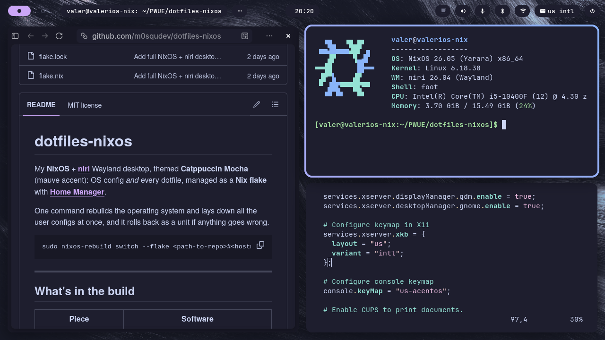

# dotfiles-nixos

My **NixOS + [niri](https://github.com/YaLTeR/niri)** Wayland desktop, themed
**Catppuccin Mocha** (mauve accent): OS config *and* every dotfile, managed as a
**Nix flake** with **[Home Manager](https://github.com/nix-community/home-manager)**.

One command rebuilds the operating system and lays down all the user configs at
once, and it rolls back as a unit if anything goes wrong.

```
sudo nixos-rebuild switch --flake <path-to-repo>#<hostname>
```

---

## Screenshots



*niri's scrollable tiling with Waybar on top — zen browser on the left, and a stacked
pair of terminals on the right (fastfetch and `nixos/configuration.nix` in vim). The
whole desktop is themed **Catppuccin Mocha** with a mauve accent.*

---

## What's in the build

| Piece | Software |
|---|---|
| Compositor / WM | **niri** (scrollable-tiling Wayland) |
| Status bar | **waybar** (+ custom module scripts) |
| Notifications & quick settings | **swaync** |
| On-screen display (volume/brightness) | **swayosd** |
| Launcher | **fuzzel** |
| Emoji / character picker | **rofimoji** (`Mod+.`, via fuzzel) |
| Lock screen | **hyprlock** (primary) · **swaylock-effects** (fallback) |
| Terminal | **GNOME Console (kgx)**, patched to a Catppuccin Mocha palette |
| GTK theme | **catppuccin-gtk** (mauve) · adw-gtk3 · Papirus-Dark icons · Catppuccin cursors |
| Qt / KDE theme | **Kvantum** `catppuccin-mocha-mauve` · qt6ct |
| Text-editor theme | GtkSourceView 5 Catppuccin Mocha scheme (GNOME Text Editor) |
| Input method | **fcitx5 + Mozc** (Japanese; US-intl / US / JP cycling) |
| GPU | per machine — see [Hosts](#hosts) |
| Login | GDM → niri session |

---

## Hosts

Two machines are built from this one flake, and everything above is shared
between them. `flake.nix` has a `mkHost` helper so both are assembled
identically — same nixpkgs, same Home Manager wiring — and a host is one line:

```nix
nixosConfigurations = {
  valerios-nix = mkHost ./hosts/valerios-nix/configuration.nix;
  valerios-laptop = mkHost ./hosts/valerios-laptop/configuration.nix;
};
```

Everything that differs is a module under `modules/hardware/` that the other
host simply doesn't import:

| | `valerios-nix` | `valerios-laptop` |
|---|---|---|
| Machine | desktop | HP Laptop 14s-dq0xxx |
| CPU | Intel | Intel i5-8265U (Whiskey Lake-U) |
| GPU | NVIDIA GTX 1650, proprietary driver — `nvidia.nix` | Intel UHD 620, VA-API via `intel-graphics.nix` |
| Battery / lid / backlight | — | `laptop.nix` (power-profiles-daemon, thermald, brightness keys) |
| Fingerprint | — | Elan `04f3:0c00` — `fingerprint.nix` |
| Wi-Fi | — | Realtek RTL8821CE (in-tree `rtw88_8821ce`; no out-of-tree driver needed) |

The fingerprint reader is the one genuinely awkward piece: **upstream libfprint
cannot drive it.** Its in-tree `elanmoc` table starts at `0c7d`, and none of the
device-ID patches nixpkgs carries adds `0c00`. `modules/hardware/fingerprint.nix`
therefore builds [Depau's `elanmoc2`
branch](https://gitlab.freedesktop.org/Depau/libfprint) at a pinned commit and
rebuilds **only fprintd** against it, rather than swapping libfprint for the
whole closure. Enrol after the first switch — the templates live on the sensor,
not in this repo:

```
fprintd-enroll     # repeat with -f for more fingers
fprintd-verify
```

---

## Repository layout

```
dotfiles-nixos/
├── flake.nix                  # entry point: mkHost + one line per host, pinned nixpkgs
├── flake.lock                 # exact input versions (reproducibility)
├── CONTRIBUTING.md            # repo layout + the "one line vs own module" rule
├── hosts/
│   ├── valerios-nix/          # desktop
│   │   ├── configuration.nix          # composition root: imports modules + host-only settings
│   │   └── hardware-configuration.nix # ⚠ machine-specific: REGENERATE on other machines
│   └── valerios-laptop/       # HP Laptop 14s-dq0xxx
│       ├── configuration.nix
│       └── hardware-configuration.nix # ⚠ generated ON that machine — not committed here
├── modules/
│   ├── core/                  # boot, nix, locale, networking, users, audio, graphics
│   ├── desktop/               # niri, gnome, fonts, input-method, theming (+ kgx patch)
│   ├── hardware/              # per-machine quirks, imported only where relevant
│   │   ├── nvidia.nix         # GTX 1650, proprietary driver
│   │   ├── intel-graphics.nix # UHD 620 VA-API userspace
│   │   ├── laptop.nix         # battery, lid, backlight (any laptop)
│   │   └── fingerprint.nix    # Elan 0c00 reader (out-of-tree libfprint)
│   └── apps/                  # zen.nix, syncthing.nix, misc.nix (the one-line apps)
├── home/
│   ├── home.nix               # Home Manager entry point (imports the two below)
│   ├── dotfiles.nix           # the bulk of ~/.config/* symlinks
│   └── gtk.nix                # GTK 4 theming (the one entry needing real logic)
├── config/                     # → ~/.config/*
│   ├── niri/  waybar/  swaync/  swayosd/  swaylock/  hypr/  fuzzel/
│   ├── kgx-mocha/  Kvantum/  qt6ct/  fcitx5/  autostart/
│   ├── gtk-3.0/  gtk-4.0/  kdeglobals
├── local/
│   └── share/gtksourceview-5/styles/catppuccin-mocha.xml   # → ~/.local/share/...
└── assets/
    ├── wallpapers/wall.jpg     # → ~/.local/share/backgrounds/wall.jpg
    └── screenshots/            # images used in this README
```

---

## Where every file goes

With this flake, **Home Manager places all of these automatically** (as symlinks)
on `nixos-rebuild switch`. The table is here so you know the mapping, and so you
can place them by hand if you *don't* use the flake.

| In this repo | Ends up at | Placed by |
|---|---|---|
| `hosts/<host>/configuration.nix` | *(read directly by the flake)*, replaces `/etc/nixos/configuration.nix` | flake |
| `hosts/<host>/hardware-configuration.nix` | *(read by the flake)*, **regenerate per machine** | flake |
| `modules/**/*.nix` | *(imported by the host's `configuration.nix`)* | flake |
| `modules/desktop/kgx-catppuccin-mocha.patch` | applied to `gnome-console` via overlay | `modules/desktop/theming.nix` |
| `config/niri/` | `~/.config/niri/` | Home Manager |
| `config/waybar/` | `~/.config/waybar/` | Home Manager |
| `config/swaync/` | `~/.config/swaync/` | Home Manager |
| `config/swayosd/` | `~/.config/swayosd/` | Home Manager |
| `config/swaylock/` | `~/.config/swaylock/` | Home Manager |
| `config/hypr/` | `~/.config/hypr/` | Home Manager |
| `config/fuzzel/` | `~/.config/fuzzel/` | Home Manager |
| `config/kgx-mocha/` | `~/.config/kgx-mocha/` | Home Manager |
| `config/Kvantum/` | `~/.config/Kvantum/` | Home Manager |
| `config/qt6ct/` | `~/.config/qt6ct/` | Home Manager |
| `config/fcitx5/` | `~/.config/fcitx5/` | Home Manager |
| `config/autostart/` | `~/.config/autostart/` | Home Manager |
| `config/gtk-3.0/settings.ini` | `~/.config/gtk-3.0/settings.ini` | Home Manager |
| `config/gtk-4.0/{settings.ini,gtk.css,gtk-dark.css}` | `~/.config/gtk-4.0/` | Home Manager |
| `config/kdeglobals` | `~/.config/kdeglobals` | Home Manager |
| `local/share/gtksourceview-5/styles/catppuccin-mocha.xml` | `~/.local/share/gtksourceview-5/styles/` | Home Manager |
| `assets/wallpapers/wall.jpg` | `~/.local/share/backgrounds/wall.jpg` | Home Manager |
| *(generated symlink)* | `~/.config/gtk-4.0/assets` → `/run/current-system/sw/share/themes/catppuccin-mocha-mauve-standard+normal/gtk-4.0/assets` | Home Manager |

---

## Replicating this build on a fresh machine

> Requires **NixOS 26.05** with flakes enabled. (This config enables flakes for
> you, but you need them on to *build* it the first time; pass
> `--extra-experimental-features 'nix-command flakes'` if your current system
> doesn't have them yet.)

1. **Get git & clone** (if you don't have git: `nix-shell -p git`):
   ```
   mkdir -p ~/PWUE && cd ~/PWUE
   git clone https://github.com/m0squdev/dotfiles-nixos.git
   ```

2. **Regenerate the hardware config** for the host you're building (mine describe
   *my* disks/kernel modules and won't match yours):
   ```
   sudo nixos-generate-config --show-hardware-config \
     > ~/PWUE/dotfiles-nixos/hosts/<host>/hardware-configuration.nix
   ```
   `hosts/valerios-laptop/hardware-configuration.nix` is **not in this repo at
   all** — it's generated on that machine. Flakes only see git-tracked files, so
   `git add` it or evaluation fails with *"Path ... is not tracked by Git"*.

3. **Make it yours.** Search-and-replace where needed:
   - **Username**: `valer` → yours, in `flake.nix`, `home/home.nix`, and the
     hardcoded `/home/valer/...` paths inside `config/niri/` and `config/waybar/`
     (niri's `spawn` can't expand `~`, so those paths are absolute).
   - **Hostname**: pick whichever host is closest to your machine and rename it —
     the `hosts/<host>/` directory, its `networking.hostName`, and its one line
     in `flake.nix` (`<name> = mkHost ./hosts/<name>/configuration.nix;`).
     Delete the other host's line and directory if you don't want it.
   - **Hardware**: the imports under `--- Hardware quirks ---` in
     `hosts/<host>/configuration.nix` are the machine-specific ones. Drop
     `nvidia.nix` without an NVIDIA card, `intel-graphics.nix` without an Intel
     iGPU, `laptop.nix` on a desktop, and `fingerprint.nix` unless you have the
     same Elan `04f3:0c00` reader (check with `lsusb`) — it builds an
     out-of-tree libfprint that is useless on any other sensor.
   - **Timezone / locale**: `Europe/Rome`, `en_GB.UTF-8` in `modules/core/locale.nix`.
   - Swap `assets/wallpapers/wall.jpg` for your own if you like (niri falls back
     to a solid Catppuccin base colour if it's missing).

4. **Build it** (git must have the files tracked; `git add -A` first if you edited):
   ```
   sudo nixos-rebuild switch --flake <path-to-repo>#<hostname>
   ```
   Existing dotfiles it wants to manage are backed up as `*.hm-bak`.

5. **Log out and pick the niri session** at the GDM login screen.
